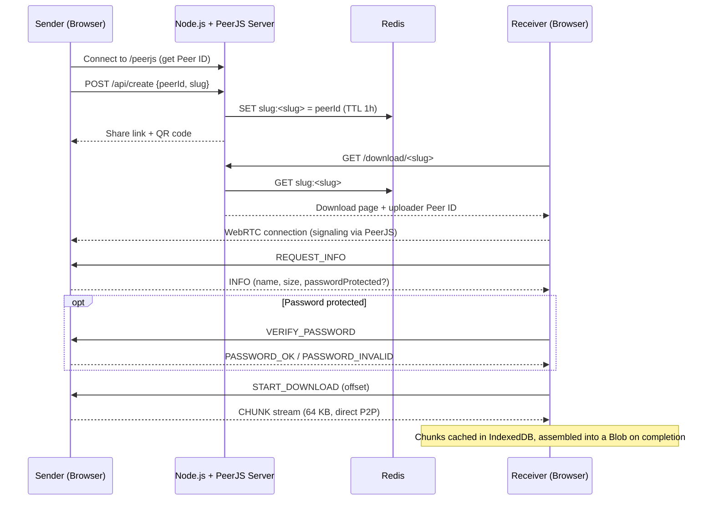
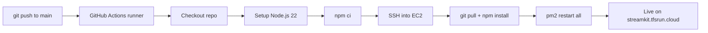

# 🌊 StreamKit — P2P File Sharing

**Live demo → [https://streamkit.tfsrun.cloud](https://streamkit.tfsrun.cloud/)**

A browser-to-browser file sharing app built with **WebRTC (PeerJS)**, **Node.js**, **Express** and **Redis**. Files travel **directly between the sender's and receiver's browsers** over WebRTC data channels. The server only handles signaling and short-lived link lookups, so file bytes never pass through it. Designed with a sleek, minimalist aesthetic inspired by Nothing Tech.


---

## ✨ Features

### Sharing
- **Direct P2P transfer**: chunks stream browser-to-browser via WebRTC Data Channels with no file upload to any server.
- **Multi-file sharing**: select several files and they are zipped in the browser (JSZip) into a single `files.zip`. Files can be removed from the staged list before sharing.
- **Multiple receivers at once**: one link can serve several downloaders, and the sender sees an independent live progress bar per peer.
- **Shareable link + QR code**: every share generates a link and a scannable QR code, so you can hand a file to a phone without typing anything.
- **Optional password protection**: set a password before generating the link. Receivers must unlock the download first.
- **Sender controls**: Pause / Resume, Cancel Transfer, Copy link, and Reset Session (which invalidates the link immediately).

### Reliability
- **Large file support**: 64 KB chunking with WebRTC **backpressure** control (`bufferedAmount` thresholds) keeps large transfers steady and crash-free.
- **Resumable downloads**: received chunks are cached in the browser's **IndexedDB**. If the connection drops, the receiver reconnects automatically and resumes from the last received offset.
- **Heartbeat monitoring**: ping/pong every 5 s, with a dead-connection timeout after 30 s, triggers auto-reconnect.
- **Client-side assembly**: chunks are compiled into a Blob only when the transfer completes, then the browser download starts automatically.
- **Session restore**: the sender's active link is remembered in LocalStorage, so refreshing the page prompts them to re-select the file and resume hosting.
- **Auto-redirect**: receivers are sent back to the homepage after 3 seconds if the sender ends the session.
- **Link expiry**: share links live in Redis with a 1-hour TTL.

### UI
- Interactive **Canvas dot-matrix background** that reacts to the mouse and reflects connection state:
  - 🟢 **Green**: connected, transfer active
  - 🟡 **Yellow**: connected but idle or paused, or reconnecting
  - 🔴 **Red**: disconnected or session reset
- Light / dark theme toggle and a responsive layout for phones, tablets and laptops.

---

## 🔐 Password Protection

Password protection is **optional**. Leave the field blank and the link is open.

- The password is held **in memory only**, in the sender's tab. It is never written to LocalStorage, never sent to the server and never stored in Redis.
- Verification happens over the existing encrypted PeerJS data connection (`VERIFY_PASSWORD` → `PASSWORD_OK` / `PASSWORD_INVALID`).
- The sender enforces the lock **per connection**: `START_DOWNLOAD` is refused until that connection is verified, so a modified client can't skip the prompt. A reconnect re-locks and the receiver must verify again.
- Receivers can see the file name and size, but cannot start the download until they unlock it.

> Note: the password acts as an access gate. It does not encrypt the file contents (the transport is already encrypted end-to-end by WebRTC's DTLS).

---

## 📱 QR Code Sharing

When you click **Generate Link**, a QR code encoding the exact share URL is rendered next to the link (using the `qrcode` library). Scan it with any phone camera to open the download page directly. The QR code is regenerated with every new link and cleared when the session resets.

---

## 🏗️ Architecture



**How it works**

1. **Sender** drops or selects one or more files, optionally sets a password, and clicks **Generate Link**. Multiple files are zipped in the browser.
2. The server maps a random slug to the sender's PeerJS ID in **Redis** (1-hour TTL) and the sender gets a link and QR code.
3. **Receiver** opens the link. The page resolves the sender's current PeerJS ID and connects directly over WebRTC.
4. If a password is set, the receiver unlocks the share, then clicks **Download**.
5. The sender slices the file into 64 KB chunks and streams them with backpressure. The receiver stores each chunk in IndexedDB and, when the last one arrives, assembles the file and saves it.

> The sender must keep their tab open while sharing, because they are the host.

---

## 🧰 Tech Stack

| Layer | Technology |
|-------|-----------|
| Frontend | HTML5, vanilla CSS3, vanilla JavaScript (ES6), HTML Canvas, EJS templates |
| P2P transport | WebRTC Data Channels via PeerJS client |
| Client libraries | PeerJS 1.5, JSZip (multi-file zip), QRCode (QR generation) |
| Backend | Node.js, Express 5, PeerJS Server (signaling) |
| Cache | Redis via ioredis (slug → peer ID map with TTL) |
| NAT traversal | STUN, plus an optional TURN server |
| CI/CD | GitHub Actions → AWS EC2 (SSH) + PM2 |
| Testing | End-to-end checks with Playwright (see `testSummary.md`) |

---

## 🗂️ Project Structure

```
P2P-file-Sharing/
├── server.js                 # Express app + PeerJS signaling server + Redis connection
├── routes/index.js           # Page routes and slug API (create / lookup / delete)
├── views/
│   ├── index.ejs             # Sender page
│   └── download.ejs          # Receiver page
├── public/
│   ├── css/                  # uploader.css, downloader.css
│   ├── js/
│   │   ├── peer-init.js      # PeerJS setup with STUN/TURN config
│   │   ├── uploader.js       # Sender state, password verification, per-peer progress
│   │   ├── uploaderEvents.js # Staging, Generate Link, QR code, pause/cancel/reset
│   │   ├── transport.js      # Chunked file streaming with backpressure
│   │   ├── downloader.js     # Receiver logic, reconnect, heartbeat, password unlock
│   │   ├── downloaderEvents.js
│   │   ├── transfer.js       # Chunk handling and final assembly
│   │   ├── db.js             # IndexedDB chunk cache
│   │   ├── common.js         # Theme toggle + canvas background
│   │   └── animations.js
│   └── sitemap.xml
├── .github/workflows/deploy.yml   # CI/CD pipeline
├── docker-compose.yml        # Local Redis
└── testSummary.md            # E2E test results
```

---

## 🚀 Installation & Setup

### Prerequisites
- [Node.js](https://nodejs.org/) v18+ (v22 recommended, matching CI)
- [Redis](https://redis.io/) running locally or reachable via URL (or use the included Docker Compose file)

### 1. Clone
```bash
git clone https://github.com/PrasadK2402/P2P-file-Sharing.git
cd P2P-file-Sharing
```

### 2. Start Redis (optional, via Docker)
```bash
docker compose up -d
```

### 3. Install dependencies
```bash
npm install
```

### 4. Configure environment variables
Create a `.env` file in the project root:
```env
PORT=3001
REDIS_URL=redis://127.0.0.1:6379
STUN_SERVER=stun:stun.l.google.com:19302

# Optional: TURN relay for strict NATs / mobile networks
TURN_SERVER=turn:your-turn-host:3478
TURN_USERNAME=your-username
TURN_PASSWORD=your-password
```

| Variable | Required | Purpose |
|----------|----------|---------|
| `PORT` | No (default `3001`) | HTTP port |
| `REDIS_URL` | No (default `redis://localhost:6379`) | Redis connection |
| `STUN_SERVER` | Recommended | STUN server for WebRTC discovery |
| `TURN_SERVER` / `TURN_USERNAME` / `TURN_PASSWORD` | Optional | Relay fallback when a direct P2P connection is impossible |

### 5. Run
```bash
npm start
```
Open [http://localhost:3001](http://localhost:3001).

---

## 📡 API

| Method | Endpoint | Description |
|--------|----------|-------------|
| GET | `/` | Sender page |
| POST | `/api/create` | Register a share: `{ peerId, slug }` → stored in Redis for 1 hour |
| GET | `/download/:slug` | Receiver page (404 if the link expired or is invalid) |
| GET | `/api/peer/:slug` | Resolve the sender's current PeerJS ID |
| POST | `/api/delete` | Remove a share: `{ slug }` |
| WS/HTTP | `/peerjs` | PeerJS signaling server |

---

## 🔄 CI/CD

Every push to `main` is deployed automatically through **GitHub Actions** (`.github/workflows/deploy.yml`, workflow name *Pipeline To Deploy*):



1. Check out the repository and set up Node.js 22
2. Install dependencies with `npm ci` (validates the lockfile)
3. SSH into the EC2 server using `appleboy/ssh-action`
4. Pull the latest code, run `npm install`, and restart the app with **PM2**

Deployment credentials are stored as encrypted GitHub secrets (`EC2_HOST`, `EC2_SSH_KEY`) under the `EC2_HOST` environment. Nothing sensitive lives in the workflow file.

---

## 🧪 Testing

End-to-end testing was done with Playwright in headed mode using a ~75 MB test file. **All 10 checklist items passed**, covering:

- Staging, removing and re-selecting files
- Multi-file zip creation and share-link generation
- Receiver progress bar (clamped to 0–100)
- Per-peer progress on the sender with two simultaneous receivers
- Successful completion of `files.zip` on both receivers

Full results are in [`testSummary.md`](./testSummary.md).

---

## 🗺️ Roadmap

- [ ] Rate limiting / lockout for wrong password attempts (the verification handler is already structured for it)
- [ ] Automated tests in the CI pipeline (currently `npm test` is a placeholder)
- [ ] Folder sharing with preserved directory structure
- [ ] Configurable link expiry

---

## 📄 License

Released under the [MIT License](./LICENSE).
